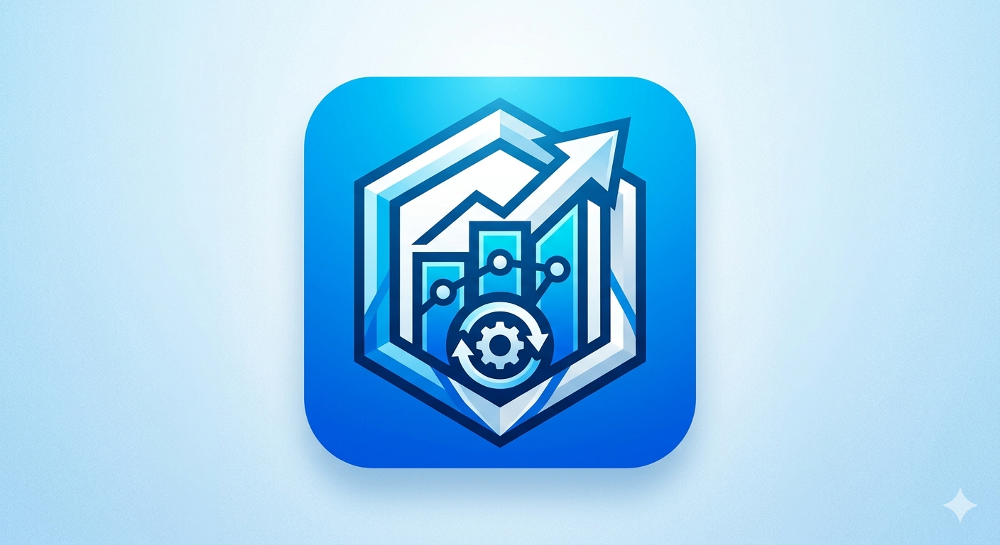

<div align="center">
  

  # OMNIFOW

  **Sistema POS multi-sucursal para retail chileno con módulo financiero integrado.**

  Caja · Inventario con FEFO · Ventas atómicas con pagos mixtos · Reservas de stock ·
  Audit log inmutable · RBAC por perfiles · Emisión interna de documentos SII.

  <sub>Python 3.13 · FastAPI · SQLAlchemy · Postgres 16 · React 18 · TypeScript · Vite</sub>

  
  
  
  
</div>

---

## Sobre este repositorio

> **Este es un proyecto de portafolio profesional.** El código está público para
> revisión, estudio y demostración. **No es software de uso libre** — ver la
> sección [Licencia](#licencia) al final.

OMNIFOW es un sistema de **Punto de Venta multi-sucursal** desarrollado bajo
**Clean Architecture** estricta, con cobertura de tests del 100% del dominio,
tipado estático completo (`mypy --strict`) y un módulo financiero/contable
integrado pensado para retail chileno.

El proyecto demuestra arquitectura de software para sistemas transaccionales
reales — manejo de concurrencia con locks pesimistas, atomicidad multi-entidad
vía Unit of Work, RBAC granular, audit trail inmutable, FEFO en perecibles, y
rotación de tokens JWT con detección de replay.

---

## Características principales

### Operación

- **POS / Ventas atómicas** con pagos mixtos (efectivo, transferencia, débito,
  crédito) y soporte de sobrepago con vuelto en efectivo.
- **Reservas de stock** ligadas a sesión de caja con `SELECT FOR UPDATE` —
  primer cajero gana, sin overselling.
- **Caja con sesiones**: apertura con monto inicial → movimientos en efectivo
  → cierre con arqueo y desglose por método de pago.
- **Inventario por bodega**: stock, costo promedio, recepción, ajustes,
  transferencias atómicas entre bodegas.
- **FEFO** (First Expired, First Out) automático en productos perecibles con
  control de vencimiento por lotes.
- **Anulación de ventas** con generación de Nota de Crédito y reverso atómico
  de stock + caja.

### Identidad y seguridad

- **JWT RS256** firmado con par de claves rotables.
- **Refresh tokens persistidos** con rotación al usar (detección de replay
  attacks → `ERR_REFRESH_REVOCADO`).
- **Argon2id** para hash de contraseñas.
- **Bloqueo temporal** tras N intentos fallidos (configurable).
- **RBAC granular**: usuarios → perfiles → permisos (códigos `recurso.accion`)
  con verificación en cada caso de uso.
- **Restricción por sucursal**: cada usuario puede operar solo en sus sucursales
  asignadas.
- **Audit log inmutable** con `before`/`after` JSON para acciones sensibles —
  visor con filtros (acción, usuario, resultado, rango de fechas).

### Documentos tributarios (Chile)

- Boleta, Factura, Nota de Crédito, Nota de Débito, Guía de Despacho.
- **Asignación de folios SII por sucursal/tipo** con lock pesimista para
  evitar conflictos.
- **Cálculo IVA 19%** con redondeo back-out (`iva = round(bruto * 19 / 119)`).
- **Comprobante 80mm** imprimible para POS térmicas.
- ⏸️ **Integración real con SII en observación** — emisión interna funciona
  end-to-end, pero la firma electrónica DTE + envío al SII está documentada
  como pendiente. No facturar legalmente hasta completarla.

### Calidad

- **Clean Architecture**: domain → application → adapters → infrastructure.
- **`mypy --strict`** sobre 246 archivos, 0 errores.
- **286 tests backend** (unit + integration) + **162 tests frontend** (Vitest +
  Testing Library).
- **Atomicidad** por Unit of Work — cualquier excepción revierte todo el flujo.
- **Idempotency-Key** header en mutaciones críticas (preparado para
  persistencia formal).
- **Dark mode + light mode** integrados con variables CSS (cero colores
  hardcoded).
- **Accesibilidad WCAG AA**: contraste 4.5:1+ en texto, skip-link, focus
  visible, `aria-*` en todos los componentes interactivos.
- **Atajos de teclado** para POS (F2 buscar, F4 confirmar, F1 ayuda, etc.).

---

## Stack técnico

### Backend

- **Python 3.13** con tipado estricto (`mypy --strict`)
- **FastAPI** para HTTP, **Pydantic v2** para validación de DTOs
- **SQLAlchemy 2.x** con sesiones tipadas
- **PostgreSQL 16** con `FOR UPDATE`, `JSONB`, `INET`, `UUID v7`
- **Alembic** para migraciones
- **PyJWT** con par RS256 + **Argon2id**
- **pytest** + **pytest-asyncio** + **testcontainers** (planificado para
  integración)

### Frontend

- **React 18** + **Vite** + **TypeScript** estricto
- **Zustand** para estado global (sesión, sucursal activa, permisos)
- **React Router v6** + guards `RequirePermission`
- **React Hook Form** + **Zod** para validación tipada
- **Lucide React** para iconografía
- **Vitest** + **Testing Library** para tests
- Cliente HTTP custom con interceptor de refresh token automático (single-flight,
  anti-loop)

### Infraestructura

- **Docker Compose** levanta Postgres + backend + frontend para desarrollo
- **Estructura monorepo**: `backend/` + `frontend/` como hermanos

---

## Quick start

### Requisitos

- Docker (para Postgres) o Postgres 16 instalado local
- Python 3.13+
- Node 20+
- `pip` o `uv` para deps de Python

### Setup

```powershell
# Clonar
git clone https://github.com/MoisesLagos123/omnifow.git
cd omnifow

# Postgres en Docker (un contenedor, expone 5432)
docker compose up -d postgres

# Backend
cd backend
python -m venv .venv
.\.venv\Scripts\Activate.ps1     # PowerShell — o `source .venv/bin/activate` en bash
pip install -e ".[dev]"
copy .env.example .env            # editar con tu password de Postgres
.\.venv\Scripts\python -m alembic upgrade head
.\.venv\Scripts\python scripts/generate_jwt_keys.py    # crea keys/jwt_{private,public}.pem
.\.venv\Scripts\python scripts/seed_perfiles_permisos.py
.\.venv\Scripts\python scripts/seed_dev_user.py        # crea admin@minierp.cl / Admin12345!
.\.venv\Scripts\python -m uvicorn erp.main:app --reload --port 8000

# Frontend (otra terminal)
cd frontend
npm install
npm run dev
```

Abrí http://localhost:5173 y entra con `admin@minierp.cl` / `Admin12345!`.

### Tests

```powershell
# Backend
cd backend
.\.venv\Scripts\python -m pytest -q          # 286 tests
.\.venv\Scripts\python -m mypy --strict src/erp  # 0 errores

# Frontend
cd frontend
npm test -- --run                             # 162 tests
npx tsc --noEmit                              # clean
```

---

## Estructura del proyecto

```
omnifow/
├── backend/
│   ├── src/erp/
│   │   ├── domain/              # Entidades + value objects + reglas puras
│   │   │   ├── entities/
│   │   │   ├── value_objects/   # Dinero, Rut, Folio, TasaImpuesto
│   │   │   ├── exceptions.py
│   │   │   └── utils/
│   │   ├── application/         # Use cases + puertos (interfaces)
│   │   │   ├── ports/           # Protocols de repos + TokenProvider + AuditPublisher
│   │   │   ├── use_cases/       # Un archivo por caso de uso (Command + Result + Class)
│   │   │   ├── services/        # Domain services
│   │   │   └── security/        # ContextoSeguridad
│   │   ├── adapters/            # Implementaciones de los puertos
│   │   │   ├── api/v1/          # Routers FastAPI por módulo
│   │   │   ├── repositories/sql/  # SQLAlchemy
│   │   │   └── security/        # JWT, Argon2, decorador @requires_permission
│   │   └── infrastructure/      # Frameworks & drivers
│   │       ├── db/              # Engine, modelos ORM, mappers, migrations
│   │       ├── web/             # FastAPI app, middleware, rate limit
│   │       ├── audit/           # AuditWriter síncrono
│   │       └── observability/
│   └── tests/{unit,integration,e2e,fixtures}
│
├── frontend/
│   └── src/
│       ├── api/                 # Cliente HTTP + módulos por área
│       ├── auth/                # Store Zustand + guards + hooks
│       ├── components/
│       │   ├── ui/              # Button, Card, Table, Modal, Tooltip, EmptyState…
│       │   └── layout/          # AuthenticatedLayout, SucursalSwitcher
│       ├── modules/             # Un dir por feature (pos, caja, inventario, admin…)
│       ├── styles/              # theme.css (tokens) + global.css + reset
│       └── routes.tsx
│
├── CLAUDE.md                    # Decisiones de arquitectura + convenciones
├── PROGRESO.md                  # Checklist vivo por módulo + handoff
├── docker-compose.yml
└── README.md
```

---

## Módulos implementados

| Módulo | Backend | Frontend | Notas |
|---|---|---|---|
| **Autenticación** (JWT + refresh con rotación) | ✅ | ✅ | Bloqueo 5/15min, logout server-side |
| **Administración** (usuarios/perfiles/permisos) | ✅ | ✅ | RBAC, asignación a sucursales |
| **Sucursales / Cajas / Folios SII** | ✅ | ✅ | AsignadorFolios con `FOR UPDATE` |
| **Inventario** (productos/categorías/bodegas) | ✅ | ✅ | Costo promedio por bodega |
| **Inventario · Lotes y vencimiento** | ✅ | ✅ | Reporte "Por vencer" + FEFO listo |
| **Clientes** | ✅ | ✅ | Validación RUT chileno |
| **Caja** (sesión/movimientos/arqueo) | ✅ | ✅ | Lock pesimista sobre sesión |
| **POS / Ventas** (atómico) | ✅ | ✅ | FEFO + pagos mixtos + NC |
| **POS · Reservas de stock** | ✅ | ✅ | Ligadas a sesión, `FOR UPDATE` |
| **Audit log viewer** | ✅ | ✅ | Filtros + detalle con before/after JSON |

### Pendientes (priorizados)

1. Compras + Proveedores + CxP — cierra el ciclo de costos
2. Cuentas por Cobrar (CxC) — ventas a crédito
3. Cambiar contraseña — aprovecha `revocar_todos_de` ya implementado
4. Configuración global SII (IVA, datos emisor, certificado)
5. ⏸️ **Firma electrónica SII (DTE real)** — en observación, ver `PROGRESO.md`

---

## Decisiones técnicas notables

- **Concurrencia**: `SELECT … FOR UPDATE` pesimista sobre stock, folios SII
  y sesiones de caja. Evita race conditions reales en venta concurrente.
- **Folios SII**: lock pesimista sobre `RangoFolios` controla agotamiento y
  permite gestión de rangos por sucursal/tipo de documento.
- **Idempotencia**: header `Idempotency-Key` aceptado en mutaciones críticas
  (persistencia formal pendiente).
- **UUID v7**: ordenable temporalmente — mejor performance en índices Postgres
  que UUID v4 random.
- **Montos**: `int` (BIGINT) en DB para CLP (sin decimales en presentación),
  `Decimal` en lógica para precisión intermedia. Cantidades en `Decimal(14,3)`.
- **Fechas**: `datetime.now(timezone.utc)` siempre — nunca el deprecado
  `datetime.utcnow()`. UTC en DB, conversión a `America/Santiago` solo en
  presentación.
- **Atomicidad multi-entidad**: cada Use Case abre/cierra su propio Unit of
  Work — si algo falla, rollback total. No hay estados inconsistentes.
- **Rotación de refresh**: cada uso revoca el anterior y emite uno nuevo —
  un atacante que intercepta un refresh y lo usa una vez es detectado en el
  segundo intento (`ERR_REFRESH_REVOCADO`).
- **Audit síncrono**: dentro del mismo UoW que la operación — consistencia
  fuerte. Interfaz `AuditPublisher` lista para migrar a Outbox + cola en el
  futuro sin cambiar los call sites.

---

## Roadmap a producción

Para operar legalmente con OMNIFOW en Chile faltan tres bloques:

- **Integración real SII** (firma electrónica DTE, generación XML conforme XSD,
  envío al SII en certificación, set de pruebas, salto a producción). Ver
  `PROGRESO.md` sección "🔭 EN OBSERVACIÓN".
- **Compras + CxP** (cierra el ciclo de costos contra recepción real).
- **Reportes mensuales SII** (RVD, IECV).

---

## Licencia

**Copyright © 2026 Moisés Lagos Fernández. Todos los derechos reservados.**

Este repositorio es **público con fines de portafolio profesional**. El código
fuente está disponible para revisión, estudio y demostración de capacidades de
ingeniería.

**No se otorga ninguna licencia de uso, modificación o distribución.** Sin
autorización escrita del autor, no está permitido:

- Usar, ejecutar o desplegar este software en producción o ambientes comerciales.
- Copiar, modificar o redistribuir el código fuente, total o parcialmente.
- Crear obras derivadas, forks o productos comerciales basados en este código.
- Eliminar o alterar avisos de copyright o atribución.

Para consultas sobre licenciamiento comercial, oportunidades laborales o
colaboración, contactar a **moises.lagos.dev@gmail.com**.

---

<div align="center">
  <sub>Hecho con Clean Architecture, tests honestos y atención a los detalles.</sub><br>
  <sub>Desarrollado por <a href="mailto:moises.lagos.dev@gmail.com">Moisés Lagos Fernández</a> · Chile 🇨🇱</sub>
</div>
